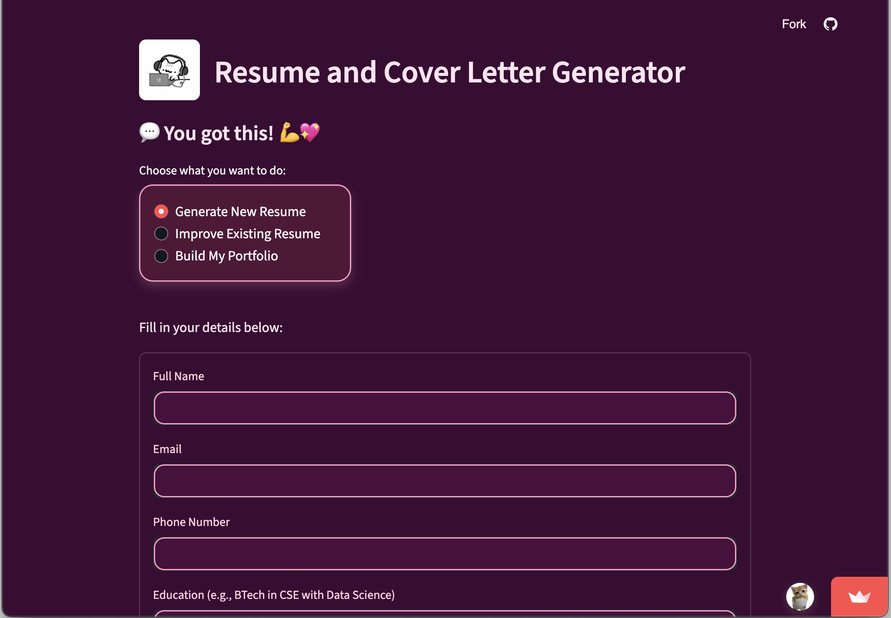
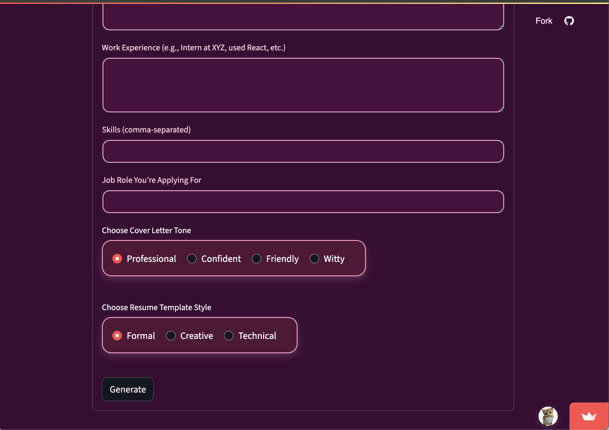
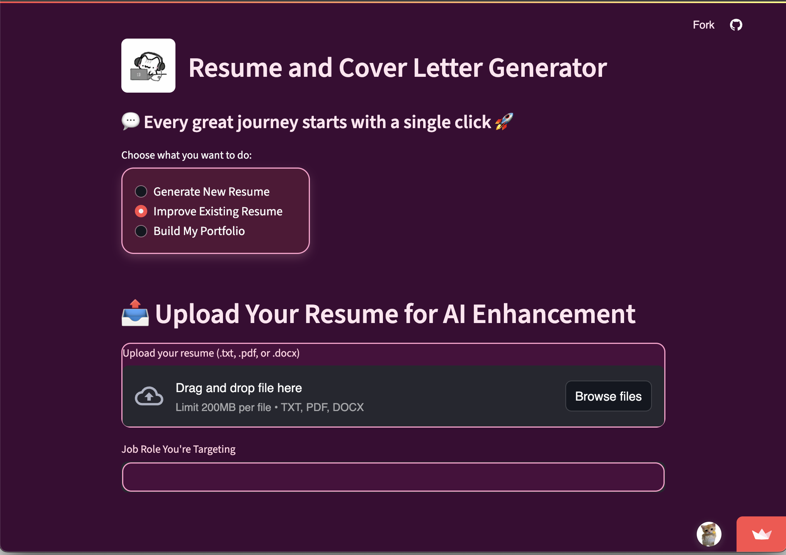
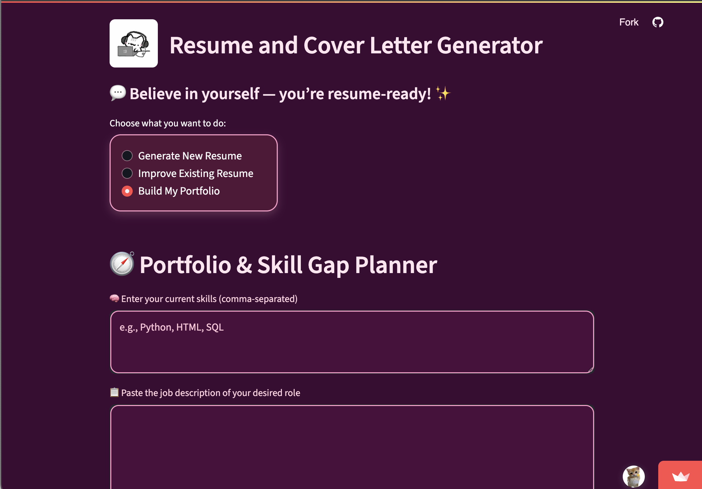

# 📄 Resume & Cover Letter Generator + AI Career Roadmap

[](https://sroowo-resume-coverletter-generator.streamlit.app)
[](https://ai.google.dev)
[](LICENSE)

> ✨ A Gemini-powered Streamlit app to help users generate polished resumes, tailored cover letters, and personalized career roadmaps — all in one pastel-themed UI.

---

## 🚀 Live Demo

🔗 [Try it here](https://resumecvgenerator.streamlit.app/)
---

## ✨ Features

- 🎨 Generate beautiful resumes in **Formal**, **Creative**, or **Technical** styles  
- 💌 Write cover letters in **Professional**, **Confident**, **Friendly**, or **Witty** tones  
- 📥 Upload an existing resume (PDF, DOCX, TXT) and enhance it with AI  
- 🗺️ Build a **personalized skill roadmap** based on your current skills and a target job  
- 📚 Get **recommended learning resources** and project ideas  
- 📄 Download final resume, cover letter, and roadmap as **PDFs**  
- 🎉 Pastel dark-mode interface with positive quotes and confetti  

---

## 🛠️ Tech Stack

- Streamlit – UI framework  
- Gemini API – by Google Generative AI  
- fpdf – for PDF creation  
- Pillow – image processing  
- PyPDF2, python-docx – file handling  
- `.streamlit/secrets.toml` – secret key management  

---

## 📸 App Preview

### 🏠 Resume & Cover Letter Generator (Home)


### 📄 Improve Existing Resume


### 🗺️ Build My Portfolio / Career Roadmap


### 🔍 Additional View (Portfolio continued)


---

## 📂 How to Run Locally

### 1. Clone the repository

```bash
git clone https://github.com/sroowo/resume-coverletter-generator.git
cd resume-coverletter-generator
pip install -r requirements.txt
```

### 2. Add your Gemini API key

Create a file named `.streamlit/secrets.toml` and paste the following:

```toml
GEMINI_API_KEY = "your-api-key-here"
```

### 3. Run the app

```bash
streamlit run app.py
```
